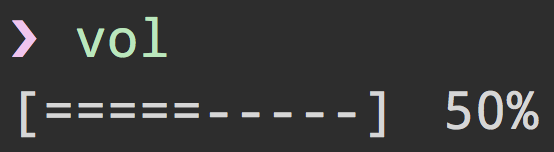

# vol

> Get and set sound volume


## Install

```
$ npm install --save vol
```


## Usage

```js
const vol = require('vol');

vol.get().then(level => {
	console.log(level);
	//=> 0.45
});

vol.set(0.65).then(() => {
	console.log('Changed volume to 65%');
});
```


## CLI



```
$ npm install --global vol
```

```
$ vol --help

  Usage
    $ vol (Interactive CLI)
    $ vol <level>
    $ vol mute
```

If encountering any problems in Windows, use the `volume` alias.


## API

### .get()

Get volume level.

### .set(level)

Set volume level.

#### level

Type: `number`

A number between `0` and `1`.


## License

MIT © [Andreas Gillström](http://github.com/gillstrom)
